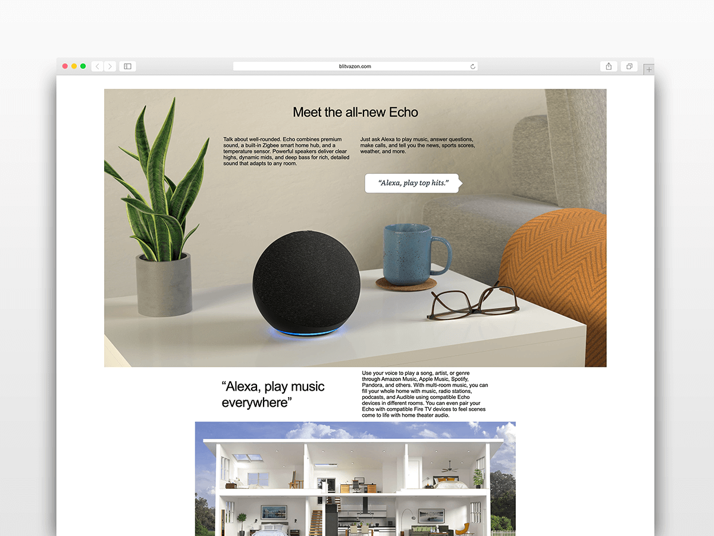

# Blitvazon Product Page - Product Features



## Technologies Used

* [React](https://github.com/facebook/react)
* [Express](http://expressjs.com/)
* [MongoDB](https://docs.mongodb.com/)
* [Mongoose](https://mongoosejs.com/docs/api.html)
* [Styled Components](https://styled-components.com/)
* [CircleCI](https://circleci.com/docs/)
* [Jest](https://jestjs.io/docs/getting-started)
* [Mocha / Chai](https://www.chaijs.com/)

## Related Projects

  - [Photos Service - Alek O.](https://github.com/blitva/photos-service)
  - [Checkout Service - Alek O.](https://github.com/blitva/checkout-service)
  - [Description Service - Amos N.](https://github.com/blitva/description-service)
  - [Reviews Service - Barsha S.](https://github.com/blitva/reviews-service)
  - [Customer Questions Service - Justin R.](https://github.com/blitva/customer-questions-service)
  - [Navigation Bar - Justin R.](https://github.com/blitva/nav-bar)
  - [Footer - Alek O.](https://github.com/blitva/footer)

## Development

These instructions will get you a copy of the project up and running on your local machine for development and testing purposes.

```sh
npm install
```

Start the dev environment
```sh
npm run react-dev
npm run start-dev
```

Seed the database
```sh
npm run seeder
```

Run tests
```sh
npm db-tests
npm server-tests
npm front-end-tests
```

Open the browser
```
http://localhost:4000
```
